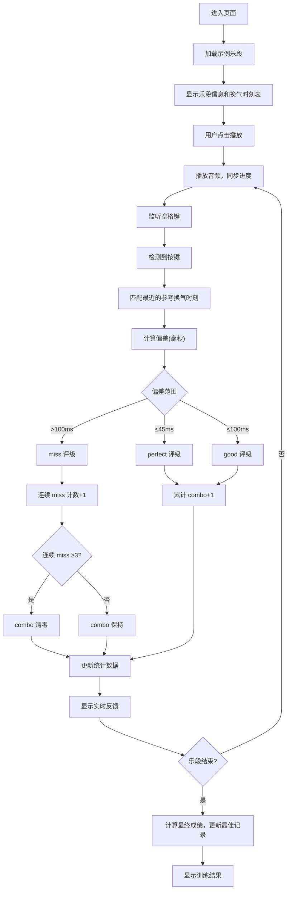

## 1. 产品概述
「轮吹换气时点偏差训练」是一款纯浏览器端的音乐训练工具，帮助吹奏乐器学员练习换气时机的精准度。通过播放参考乐段，学员在标记处按空格键，系统实时计算按键与参考时刻的偏差并给出评分。

- 核心用途：训练吹奏乐器的换气时机精准度
- 目标用户：管乐学习者、音乐教师
- 产品价值：提供即时、量化的反馈，帮助学员精准掌握换气时机

## 2. 核心功能

### 2.1 功能模块

| 模块名称 | 功能描述 |
|---------|---------|
| 乐段播放 | 播放参考乐段音频，同步显示进度 |
| 按键检测 | 监听空格键，记录学员按键时刻 |
| 偏差计算 | 计算按键时刻与参考换气时刻的时间差 |
| 评分系统 | 根据偏差给出 perfect/good/miss 评级 |
| Combo 机制 | 连续命中累计 combo，连续3次 miss 断 combo |
| 数据统计 | 实时显示 combo、各轮命中率、平均偏差 |
| 成绩记录 | 本地存储个人最佳成绩 |
| 乐段管理 | 支持自定义乐段数据和音频替换 |

### 2.2 页面详情

| 页面名称 | 模块名称 | 功能描述 |
|---------|---------|---------|
| 训练主页 | 乐段信息区 | 显示当前乐段名称、轮次信息、换气时刻表 |
| 训练主页 | 播放控制区 | 播放/暂停/重置按钮，进度条显示 |
| 训练主页 | 实时反馈区 | 显示当前 combo、最近一次评级、偏差毫秒数 |
| 训练主页 | 统计面板 | 各轮命中率柱状图、平均偏差、最佳成绩 |
| 训练主页 | 操作说明 | 空格键操作提示、评分规则说明 |

## 3. 核心流程

## 4. 用户界面设计

### 4.1 设计风格

- **设计基调**：专业音乐训练工具风格，深色主题配合霓虹蓝/紫色调，营造专注训练氛围
- **主色调**：深靛蓝背景 `#0f172a`，霓虹蓝 `#06b6d4` 作为主强调色，紫色 `#a855f7` 作为辅助色
- **评分颜色**：perfect - 金色 `#fbbf24`，good - 绿色 `#22c55e`，miss - 红色 `#ef4444`
- **按钮风格**：圆角矩形，带发光 hover 效果，3D 按压反馈
- **字体**：使用 `Space Grotesk` 作为标题字体，`Inter` 作为正文字体，等宽字体显示数值
- **布局风格**：卡片式布局，毛玻璃效果背景，清晰的视觉层次
- **动效风格**：按键时的脉冲动画、评级弹出动画、combo 递增的数字滚动效果

### 4.2 页面设计概述

| 页面名称 | 模块名称 | UI 元素 |
|---------|---------|---------|
| 训练主页 | 顶部标题区 | 大字号标题，最佳成绩徽章，设置按钮 |
| 训练主页 | 乐段信息卡 | 乐段名称、总时长、轮次数、换气点总数 |
| 训练主页 | 波形进度区 | 音频波形可视化，换气标记点，播放进度指示器 |
| 训练主页 | 实时反馈区 | 大号 combo 数字，评级显示（perfect/good/miss），偏差毫秒数 |
| 训练主页 | 统计面板 | 各轮命中率柱状图，平均偏差数字，各项统计指标 |
| 训练主页 | 控制按钮区 | 播放/暂停按钮，重置按钮，音量控制 |
| 训练主页 | 换气时刻表 | 表格展示各轮换气时刻和命中状态 |
| 训练主页 | 操作说明 | 底部浮动提示，评分规则说明 |

### 4.3 响应式设计

- 采用桌面优先设计，适配 1280px 及以上屏幕
- 平板设备：统计面板改为上下布局
- 移动设备：单列布局，简化波形显示区域
- 触摸优化：按钮最小尺寸 48x48px，支持触摸按键

## 5. 评分规则

| 评级 | 偏差范围 | 说明 |
|------|---------|------|
| perfect | 0 - 45ms | 非常精准 |
| good | 46 - 100ms | 良好 |
| miss | > 100ms 或 未按键 | 偏差过大 |

- Combo 机制：每次 perfect 或 good 累计 combo+1，连续 3 次 miss 则 combo 清零
- 命中率计算：(perfect 数 + good 数) / 总换气点数量 × 100%
- 平均偏差：所有命中时刻偏差的绝对值平均值
