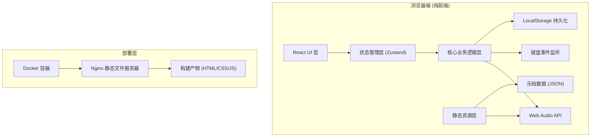

## 1. 架构设计



## 2. 技术选型

- **前端框架**：React 18 + TypeScript
- **构建工具**：Vite 5
- **样式方案**：TailwindCSS 3
- **状态管理**：Zustand
- **音频处理**：原生 Web Audio API
- **图标库**：Lucide React
- **部署方式**：Docker + Nginx 静态部署
- **无后端**：纯前端应用，数据全部本地存储

## 3. 目录结构

```
src/
├── components/          # React 组件
│   ├── Header.tsx       # 顶部标题栏
│   ├── MusicInfo.tsx    # 乐段信息卡片
│   ├── WaveformProgress.tsx  # 波形进度条
│   ├── RealtimeFeedback.tsx  # 实时反馈区
│   ├── StatsPanel.tsx   # 统计面板
│   ├── ControlButtons.tsx    # 控制按钮
│   ├── BreathSchedule.tsx    # 换气时刻表
│   └── Instructions.tsx # 操作说明
├── hooks/               # 自定义 Hooks
│   ├── useAudioPlayer.ts    # 音频播放 Hook
│   ├── useKeyPress.ts       # 按键监听 Hook
│   └── useTrainingLogic.ts  # 训练逻辑 Hook
├── store/               # Zustand 状态管理
│   └── useTrainingStore.ts
├── data/                # 静态数据
│   └── sampleMusic.ts   # 示例乐段数据
├── types/               # TypeScript 类型定义
│   └── index.ts
├── utils/               # 工具函数
│   ├── scoring.ts       # 评分计算
│   └── storage.ts       # 本地存储
├── App.tsx              # 根组件
├── main.tsx             # 入口文件
└── index.css            # 全局样式

public/
└── audio/               # 音频文件
    └── sample.mp3       # 示例乐段音频

Dockerfile               # Docker 配置
nginx.conf               # Nginx 配置
README.md                # 使用说明
```

## 4. 数据模型

### 4.1 乐段数据结构

```typescript
interface BreathPoint {
  time: number;           // 毫秒偏移量
  round: number;          // 第几轮吹奏
}

interface MusicData {
  id: string;
  name: string;           // 乐段名称
  duration: number;       // 总时长(毫秒)
  audioUrl: string;       // 音频文件路径
  totalRounds: number;    // 总轮数
  breathPoints: BreathPoint[];  // 换气时刻列表
}
```

### 4.2 训练记录结构

```typescript
type Rating = 'perfect' | 'good' | 'miss';

interface HitRecord {
  breathPointIndex: number;
  pressTime: number;      // 实际按键时间(毫秒)
  referenceTime: number;  // 参考时间(毫秒)
  deviation: number;      // 偏差(毫秒)
  rating: Rating;
  round: number;
}

interface TrainingStats {
  combo: number;
  maxCombo: number;
  consecutiveMiss: number;
  totalPerfect: number;
  totalGood: number;
  totalMiss: number;
  averageDeviation: number;
  roundStats: RoundStat[];
}

interface RoundStat {
  round: number;
  total: number;
  hit: number;
  hitRate: number;
}

interface BestRecord {
  musicId: string;
  maxCombo: number;
  totalHitRate: number;
  averageDeviation: number;
  date: string;
}
```

## 5. 核心算法

### 5.1 换气点匹配算法

```typescript
function findNearestBreathPoint(
  pressTime: number,
  breathPoints: BreathPoint[],
  matchedIndices: Set<number>
): { index: number; deviation: number } | null {
  // 只匹配未命中的换气点
  // 在 ±150ms 范围内查找最近的换气点
  // 返回匹配到的索引和偏差值
}
```

### 5.2 评分算法

```typescript
function calculateRating(deviation: number): Rating {
  const absDev = Math.abs(deviation);
  if (absDev <= 45) return 'perfect';
  if (absDev <= 100) return 'good';
  return 'miss';
}
```

### 5.3 Combo 计算逻辑

```typescript
function updateCombo(currentCombo: number, rating: Rating, consecutiveMiss: number): {
  newCombo: number;
  newConsecutiveMiss: number;
} {
  if (rating === 'miss') {
    const newMiss = consecutiveMiss + 1;
    return {
      newCombo: newMiss >= 3 ? 0 : currentCombo,
      newConsecutiveMiss: newMiss
    };
  }
  return {
    newCombo: currentCombo + 1,
    newConsecutiveMiss: 0
  };
}
```

## 6. 状态管理设计

```typescript
interface TrainingState {
  // 播放状态
  isPlaying: boolean;
  currentTime: number;
  
  // 训练数据
  musicData: MusicData | null;
  hitRecords: HitRecord[];
  matchedIndices: Set<number>;
  
  // 实时统计
  stats: TrainingStats;
  lastRating: Rating | null;
  lastDeviation: number | null;
  
  // 最佳记录
  bestRecord: BestRecord | null;
  
  // Actions
  setMusicData: (data: MusicData) => void;
  startPlaying: () => void;
  stopPlaying: () => void;
  resetTraining: () => void;
  handleKeyPress: (pressTime: number) => void;
  updateProgress: (time: number) => void;
  finishTraining: () => void;
}
```

## 7. 关键技术点

### 7.1 高精度计时

- 使用 `performance.now()` 获取高精度时间戳
- 音频播放时间与 `currentTime` 同步
- requestAnimationFrame 实现平滑进度更新

### 7.2 音频同步播放

- 使用 HTML5 Audio 元素播放
- 监听 `timeupdate` 事件同步进度
- 支持播放、暂停、seek 操作

### 7.3 键盘事件处理

- 全局监听 `keydown` 事件
- 防抖处理，避免重复触发
- 支持空格键触发

### 7.4 本地存储

- 使用 `localStorage` 存储最佳成绩
- 按乐段 ID 分别存储
- JSON 序列化存储

## 8. Docker 部署配置

- 使用 `nginx:alpine` 作为基础镜像
- 多阶段构建：Node 镜像构建 → Nginx 镜像部署
- 暴露 80 端口
- 配置 Nginx 支持 SPA 路由
